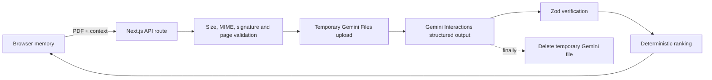

# NegoBrief

**Know what to negotiate before you sign.**

NegoBrief is an India-focused contract negotiation copilot for freelancers. It turns an English client-agreement PDF into three evidence-backed negotiation moves, practical fallback positions, a client-ready message, document-grounded Q&A, and a lawyer-preparation brief.

> NegoBrief provides informational assistance. It is not a law firm, does not provide legal advice, and does not decide whether a contract term is legal, valid, or enforceable.

## Chosen vertical and persona

The project serves an independent Indian developer, designer, writer, marketer, or consultant who has received a client contract and needs to respond before signing. This narrow persona makes the assistant more useful than a generic legal chatbot: payment timing, scope creep, ownership of reusable work, portfolio rights, termination, liability, and dispute location affect freelancers in specific ways.

## Why it is different

Most document assistants return the same summary for every reader. NegoBrief separates extraction from decision logic:

1. Gemini extracts facts and clause-grounded findings from the PDF.
2. Zod rejects malformed or incomplete model output.
3. A deterministic engine ranks findings from severity, confidence, deal value, client location, signing status, and the freelancer's two selected priorities.
4. The interface turns the top three findings into an ideal request, a commercially realistic fallback, a question for counsel, and a calm client message.

Changing the user's priorities changes the order of the conversation without changing the underlying evidence.

## Product flow

- **Instant sample:** a quota-independent synthetic agreement and precomputed analysis let judges reach the core value in one click.
- **Live PDF review:** upload an English PDF up to 10 MB and 80 pages.
- **Snapshot:** inspect parties, fees, dates, payment, termination, governing law, dispute forum, and missing protections.
- **Negotiate:** work through the three most relevant issues with exact quotations and page numbers.
- **Ask the contract:** get answers only when the document provides evidence; unsupported questions show uncertainty.
- **Lawyer brief:** download a Markdown evidence pack or print a clean brief.

## Architecture and data flow



There is no database, login, document-history feature, or analytics pipeline containing contract text. The selected PDF remains in browser memory so each Q&A request can upload it again; refreshing the page clears the session. Temporary Gemini deletion is attempted in a `finally` block after every request.

## Technology

- Next.js 16 App Router and React 19
- TypeScript with strict checking
- Tailwind CSS 4 plus a custom responsive design system
- Gemini `@google/genai` Interactions and Files APIs
- Zod schemas for every model and API boundary
- PDF-lib for signature/page/encryption checks
- GSAP with reduced-motion support
- Vitest, Testing Library, jest-axe, and synthetic PDF fixtures

## Local setup

Requirements: Node.js 22.22+ or Node.js 24 LTS and a Gemini API key for live uploads. The instant sample works without a key.

```bash
npm install
cp .env.example .env.local
npm run dev
```

On Windows PowerShell, use `Copy-Item .env.example .env.local` instead of `cp`.

Set these server-only variables in `.env.local`:

```dotenv
GEMINI_API_KEY=your-key
GEMINI_MODEL=gemini-3.8-flash
```

Then open [http://localhost:3000](http://localhost:3000).

## Commands

```bash
npm run dev        # local development
npm run typecheck  # strict TypeScript validation
npm run lint       # Next.js and React lint rules
npm run test:run   # deterministic unit/component tests
npm run build      # production build
npm run quality    # complete quality gate
```

The three synthetic contracts live in `output/pdf/`. Recreate them with the bundled Python/reportlab environment by running `python scripts/generate_fixtures.py`.

## API contracts

### `POST /api/analyze`

Multipart fields:

- `file`: English PDF, at most 10 MB and 80 pages.
- `context`: JSON matching `UserContext` in `lib/schemas.ts`.

Returns `AnalysisResult`: extracted facts, evidence-backed risk items, deterministic scores, the top three moves, missing protections, and a client message.

### `POST /api/ask`

Multipart fields:

- `file`: the original PDF.
- `context`: current `UserContext` JSON.
- `question`: 3–500 characters.

Returns `DocumentAnswer`: answer, zero to five page-grounded quotations, explicit uncertainty, optional follow-up, and a professional-review indicator.

Expected client errors use safe messages and stable codes such as `INVALID_PDF`, `FILE_TOO_LARGE`, `PASSWORD_PROTECTED`, `RATE_LIMITED`, `AI_QUOTA`, and `INVALID_AI_RESPONSE`. Provider internals and document text are never included in error responses.

## Security and responsible design

- API keys are read only on the server.
- MIME type, extension, `%PDF-` signature, byte size, encryption, readability, and page count are checked before upload.
- Documents are treated as untrusted input. The model is explicitly instructed to ignore commands inside a document.
- Model output must match strict JSON schemas and every finding requires an exact quotation and positive page number.
- Content renders as React text; raw model HTML is never injected.
- A restrictive Content Security Policy, clickjacking protection, content-type protection, referrer policy, and browser permissions policy are enabled.
- A lightweight abuse guard limits repeated API requests per process.
- No legal-validity or enforceability verdict is generated. High-impact uncertainty is escalated to professional review.

## Accessibility

The interface uses semantic landmarks, real labels and fieldsets, keyboard-operable tabs and disclosures, visible focus styles, text labels in addition to risk colors, live regions for asynchronous feedback, responsive layouts, and `prefers-reduced-motion` handling. Component accessibility is checked with jest-axe.

## Testing strategy

The automated suite verifies:

- Priority, deal-value, cross-border, and signing-status ranking behavior.
- Evidence stays unchanged when ranking context changes.
- Exactly three negotiation moves and a client message are produced.
- Schemas reject missing quotations and invalid page references.
- Unsupported questions return uncertainty instead of invented answers.
- Valid PDF fixtures pass while spoofed and wrong-type files fail.
- The context form exposes accessible labels and has no detected axe violations.

The synthetic evaluation set covers:

1. Net-60 payment after undefined acceptance and unlimited revisions.
2. Broad ownership, portfolio prohibition, and AI-training rights.
3. Unlimited indemnity, asymmetric termination, and a foreign dispute venue.

## Judge demo script

1. Click **Try the instant demo** on the hero.
2. Open the first negotiation move and show the exact quote, page, ideal request, and fallback.
3. Change priorities to **Portfolio rights** and **IP ownership**; show that the ordering changes instantly.
4. Copy the generated client message.
5. Ask “Who owns my reusable code?” and show evidence plus uncertainty.
6. Open **Lawyer brief** and download the Markdown pack.
7. Return to the landing page and explain that a configured deployment accepts live PDFs with the same verified response shape.

## Evaluation mapping

| Focus | Evidence in this repository |
| --- | --- |
| Smart, dynamic assistant | Context-aware deterministic ranking plus structured Gemini extraction |
| Logical decisions | Transparent scoring factors and reproducible priority changes |
| Practical usability | Negotiation asks, fallbacks, copyable message, Q&A, exportable brief |
| Code quality | Strict schemas, separated prompts/services/ranking, typed API contracts |
| Security | Ephemeral processing, validation, safe errors, CSP, prompt-injection boundary |
| Efficiency | One analysis call, three prioritized moves, no database or heavy retrieval layer |
| Testing | Unit, schema, PDF, grounding, and accessibility coverage |
| Accessibility | Keyboard, focus, non-color labels, live feedback, reduced motion, mobile layout |

## Deployment

Deploy the repository to Vercel, add `GEMINI_API_KEY` and `GEMINI_MODEL` as encrypted project environment variables, and redeploy. Do not expose either variable with a `NEXT_PUBLIC_` prefix.

Public demo URL: add the final Vercel URL here before submission.

## Assumptions and known limits

- Input is an English, text-readable PDF. OCR for scanned documents is not included.
- DOCX, version comparison, authentication, saved history, multilingual output, automated redlining, and legal research are intentionally out of scope.
- India focus shapes the freelancer checklist and negotiation preparation; it is not a substitute for jurisdiction-specific advice.
- “NegoBrief” is a working hackathon name and has not undergone trademark clearance.

## Repository rules

The submission is maintained on the single `main` branch. Generated dependencies, environment files, build outputs, test coverage, local uploads, and rendered QA images are excluded from Git so the public repository remains below the 10 MB limit.
